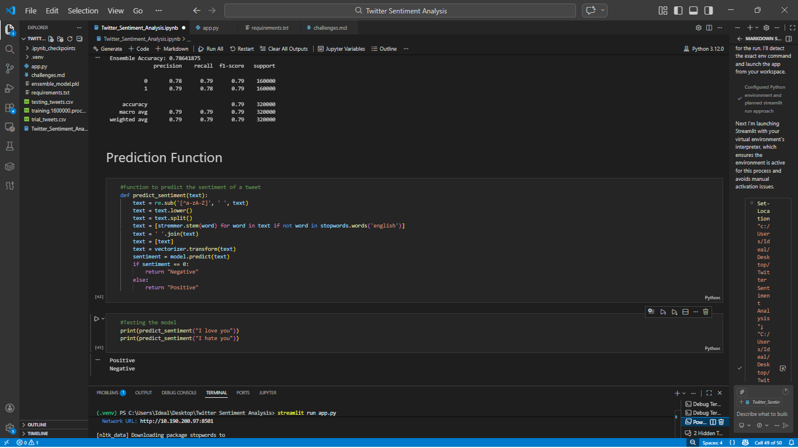
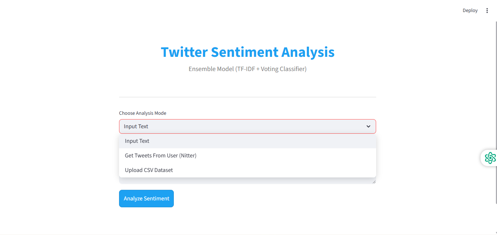
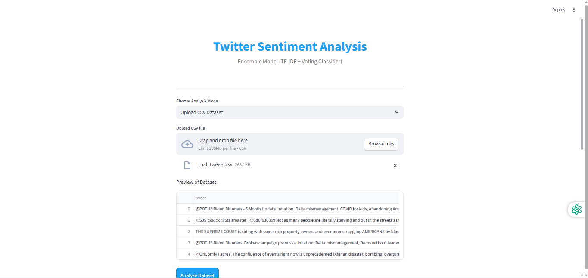
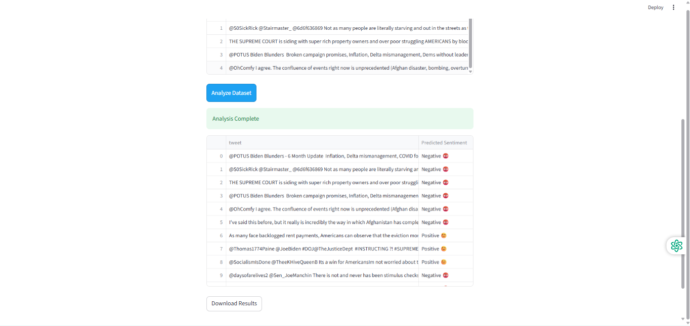

# Twitter Sentiment Analysis App 🚀

A Streamlit-based web application for performing sentiment analysis on tweets using a trained machine learning model.

---

## 🔥 Features

- ✅ Single tweet sentiment prediction  
- ✅ Batch sentiment analysis via CSV upload  
- ✅ Downloadable results  
- ✅ Clean and interactive Streamlit UI  

---

## ⚠️ Problem Faced

Initially, the application was designed to fetch tweets directly using:

- Twitter API v2  
- Web scraping tools (ntscraper)  

However:

- API access required paid tiers  
- Scraping faced rate limiting and blocking  
- Data access was unreliable  

---

## 💡 Solution Implemented

To overcome API limitations, the application was redesigned to:

- Allow CSV file uploads  
- Enable batch processing  
- Remove dependency on third-party API restrictions  
- Improve scalability and reliability  

---

## 📂 CSV Format

```csv
tweet_text
"This is my first tweet text"
"Another tweet example here"
```

---

## 🛠️ Tech Stack

- Python  
- Streamlit  
- Scikit-learn  
- Pandas  
- NLTK  

---

## 🚀 How to Run

```bash
pip install -r requirements.txt
streamlit run app.py
```

---

## 📈 Future Improvements

- Twitter API integration (if budget allows)  
- Support for JSON and Excel formats  
- Deployment to cloud platform  

---

## 📸 App Preview

  





---

## 👨🏽‍💻 Author

**Justice Ekuban**  
Aspiring AI Engineer