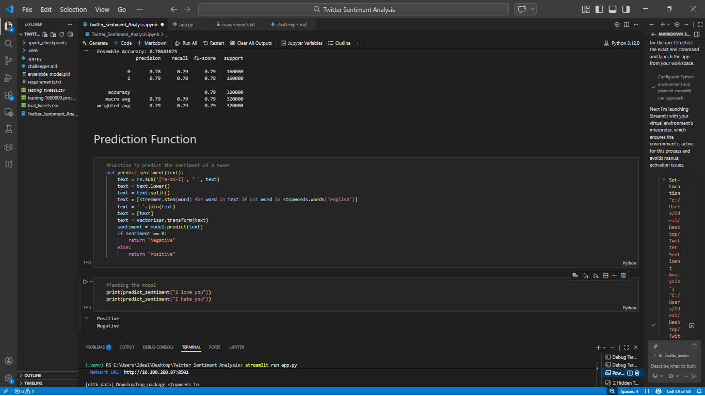
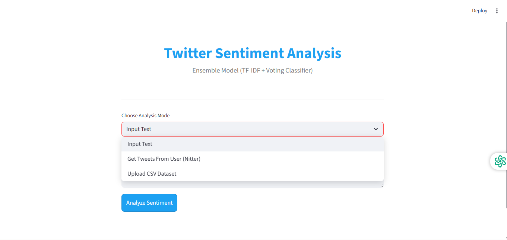
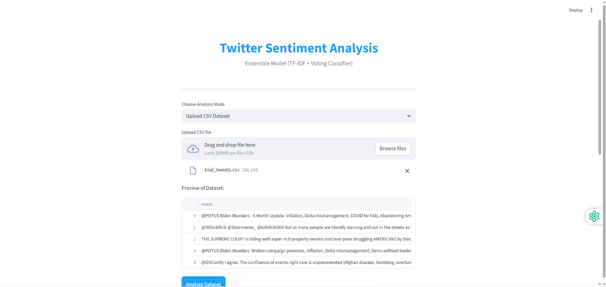
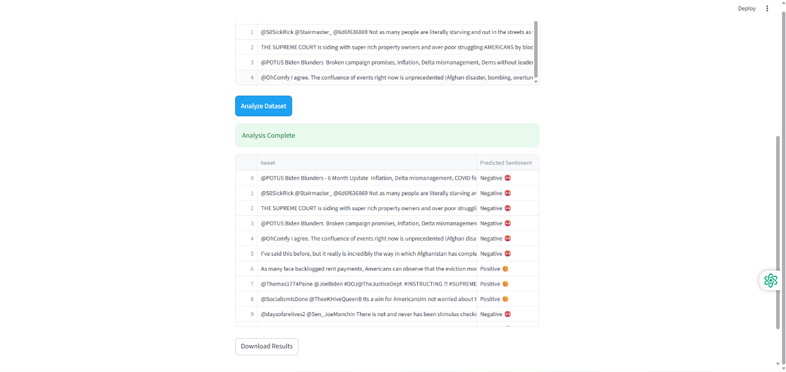

# Twitter Sentiment Analysis App 🚀

A Streamlit-based web application for performing sentiment analysis on tweets using a trained machine learning model.

---

## 🔥 Features

- ✅ Single tweet sentiment prediction  
- ✅ Batch sentiment analysis via CSV upload  
- ✅ Downloadable results  
- ✅ Clean and interactive Streamlit UI  

---

## ⚠️ Problem Faced

Initially, the application was designed to fetch tweets directly using:

- Twitter API v2  
- Web scraping tools (ntscraper)  

However:

- API access required paid tiers  
- Scraping faced rate limiting and blocking  
- Data access was unreliable  

---

## 💡 Solution Implemented

To overcome API limitations, the application was redesigned to:

- Allow CSV file uploads  
- Enable batch processing  
- Remove dependency on third-party API restrictions  
- Improve scalability and reliability  

---

## 📂 CSV Format

```csv
tweet
"This is my first tweet text"
"Another tweet example here"
```

The uploaded CSV must use a `tweet` column, matching the column checked by
`app.py`.

---

## 🛠️ Tech Stack

- Python  
- Streamlit  
- Scikit-learn  
- Pandas  
- NLTK  

---

## 🚀 How to Run

```bash
pip install -r requirements.txt
streamlit run app.py
```

## Optional Xquik Source

Use Xquik server-side when you want fresh X/Twitter posts without reintroducing
scraping or direct API dependencies in the Streamlit app. Keep `XQUIK_API_KEY`
outside the repository, fetch posts on your server, export them to a CSV with a
`tweet` column, and upload that CSV through the existing batch workflow.

---

## 📈 Future Improvements

- Server-side X/Twitter data imports through a managed source such as Xquik
- Support for JSON and Excel formats  
- Deployment to cloud platform  

---

## 📸 App Preview

  





---

## 🙏 Acknowledgments

- Huge thanks to [AstroCoder](https://www.youtube.com/@astrocoder.official) on YouTube for their excellent sentiment analysis tutorial that helped me get started with this project!


## 👨🏽‍💻 Author

**Justice Ekuban**  
Aspiring AI Engineer
